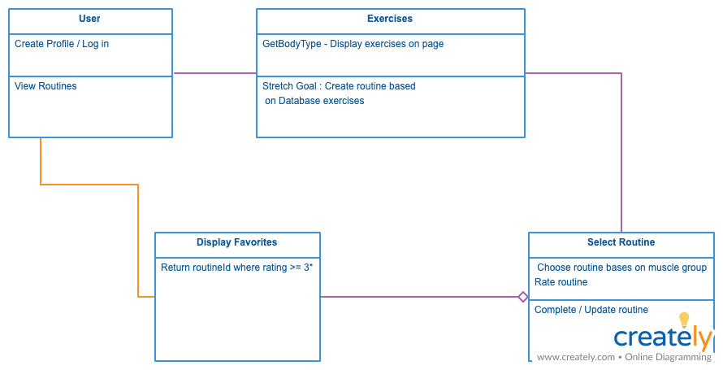
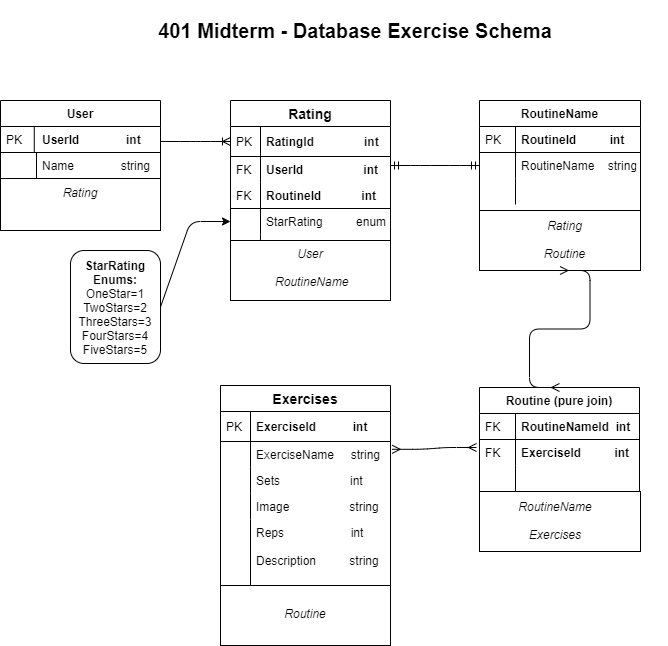

# Health At Home

## Team BuzzLightYear
---
### We are deployed on Azure!

Front End: https://healthathome.azurewebsites.net/  

Back End: https://healthathomeapi.azurewebsites.net/

Swagger: https://healthathomeapi.azurewebsites.net/swagger/v1/swagger.json

---
## Web Application
<!-- ***[Explain your app, should be at least a paragraph. What does it do? Why should I use? Sell your product!]***

The web application consists of a frontend written in Razor views, HTML, CSS,
Bootstrap, Popper, and jQuery. The backend was written in C# using ASP.NET Core 2, Entity Framework Core, and the MVC framework.

An interface is provided to create new blog
posts, view existing blog posts, edit existing blog posts, delete existing
blog posts, and search by both keywords and usernames. All blog posts can be
enriched using Azure Language Services (part of Microsoft's Cognitive Services
suite), Bing Image API, and Parallel Dots (for automated tagging of posts via
key phrases detected within the post's body). Image enrichments can be added
based on the overall sentiment score (a range 0.0 - 1.0 related to the mood
of the post) and key phrases / keywords detected in the posts. Optionally, users
can choose to opt-out of these features for privacy or data collection concerns. -->

---

## Tools Used
Microsoft Visual Studio Community 2019 

- C#
- ASP.Net Core
- Entity Framework
- MVC
- Azure
- Postman


---

## Getting Started

Clone this repository to your local machine.

```
$ git clone https://github.com/BuzzLightYearDotNet401/API-Team.git
```
Once downloaded, you can either use the dotnet CLI utilities or Visual Studio 2017 (or greater) to build the web application. The solution file is located in the AmandaFE subdirectory at the root of the repository.
```
cd YourRepo/YourProject
dotnet build
```
The dotnet tools will automatically restore any NuGet dependencies. Before running the application, the provided code-first migration will need to be applied to the SQL server of your choice configured in the /AmandaFE/AmandaFE/appsettings.json file. This requires the Microsoft.EntityFrameworkCore.Tools NuGet package and can be run from the NuGet Package Manager Console:
```
Update-Database
```
Once the database has been created, the application can be run. Options for running and debugging the application using IIS Express or Kestrel are provided within Visual Studio. From the command line, the following will start an instance of the Kestrel server to host the application:
```
cd YourRepo/YourProject
dotnet run
```
Unit testing is included in the AmandaFE/FrontendTesting project using the xUnit test framework. Tests have been provided for models, view models, controllers, and utility classes for the application.

---

## Usage
<!-- ***[Provide some images of your app with brief description as title]*** -->

### Overview of Recent Posts
<!--  -->

### Creating a Post
<!--  -->

### Enriching a Post
<!--  -->

### Viewing Post Details
<!--  -->

---
## Data Flow (Frontend, Backend, REST API)
- When the user "logs in" to the app, a request is made to the Users table of the database and determines if that user exists.
  - If the user exists, then the username is returned, and they are "logged in".
  - If the user does not exist, then a user is created and inserted into the DB, and then they are "logged in".
- When the user views the list of routines, a request is made to the Routines table, and returns a list of all routines in the database. The data is then enumerated over and rendered on the routines View.
- When the user decides to view a specific routine, a request is made to the DB for the routine, which then returns the exercies associated with that routine and renders them on the specific routine View.
- When a user clicks to give a routine a rating, a form is submitted to the Ratings table that associates the rating given to the entry matched by the UserID and the RoutineID.
- When a user views the "Liked Routines" View, the DB is queried for all Routines that match the UserID and have a Rating of at least three stars.  


---
## Data Model

### Overall Project Schema
Our schema consists of 5 tables: User, Rating, Exercise, Routine Name, Routine.  
 
**User:**  
Our user table has a one:one relationship with the properties of only its Primary Key and Name. 
 
**Rating:**  
With a many:many relationship, the ratings has our userId in as a Foreign Key that allows us to get the ratings for that specific user. We have another Foreign Key of RoutineID that lets us access all the user's liked routines. The rating 1-5 scale and is type enum.  

**Exercise:**  
This table has properties that describes all of our exercises. It does not take an Foreign Keys but is used by our Routine pure join table.  

**Routing Name:**  
This table has a relationship with our Exercise and Routine(pure join) tables as they have this table in as a Foreign Key. It also has to property of RoutineName to give us the names of our routines. 

**Routine:**  
This is our pure join table where it takes in the RoutineNameId and ExerciseID as Foreign Keys. This allows us to pair up the correct exercises and routines that are associated to each other. 



---
## Model Properties and Requirements

### User

| Parameter | Type | Required |
| --- | --- | --- |
| ID  | int | YES |
| Name | string | YES |

### Exercises

| Parameter | Type | Required |
| --- | --- | --- |
| ID | int | YES |
| ExerciseName | string | YES |
| Sets | int | YES |
| Reps | int | YES |
| Image | string | YES |
| Description | string | YES |

### Routine Name

| Parameter | Type | Required |
| --- | --- | --- |
| ID | int | YES |
| NameOfRoutine | string | YES |

### Rating

| Parameter | Type | Required |
| --- | --- | --- |
| ID | int | YES |
| UserId | int | YES |
| RoutineNameId | int | YES |
| StarRating | enum| YES |

### Routine

| Parameter | Type | Required |
| --- | --- | --- |
| RoutineNameId | int | YES |
| ExerciseId | int | YES |


---

## Change Log
0.8: *Installed Swagger and updating images into our dbContext* - 16 April 2020  
0.7: *Fixed the big in our routine names service, exercises successfully renders when querying routine name by ID* - 15 April 2020  
0.6: *Finshed final interface, service, and DTO for our routine names model* - 15 April 2020  
0.5: *Created DTOs for Users, Exercises, and Ratings* - 14 April 2020 
0.4: *Users, Exercises, and RoutineNames successfully renders to Postman* - 14 April 2020  
0.3: *Created the Interface, Service, and Controllers for Exercises, Rating, User, and RoutineName models* - 14 April 2020  
0.2: *Seeded dummy data into the database for deployment and deployed web app and database on azure* - 13 April 2020  
0.1: *Created initial skeleton for our database* - 12 April 2020   

---

## Authors
Sue Tarazi
- [GitHub](https://github.com/suetarazi)
- [LinkedIn](https://www.linkedin.com/in/sue-tarazi-b792b520)  

Allyson Reyes
- [GitHub](https://github.com/areyes986)
- [LinkedIn](https://www.linkedin.com/in/allyson-reyes/)


Carrington Beard
- [GitHub](https://github.com/Carringtonb)
- [LinkedIn](https://www.linkedin.com/in/carrington-beard/)

Brandon Johnson
- [GitHub](https://github.com/SplinterCel3000)
- [LinkedIn](https://www.linkedin.com/in/brandon-johnson-33a581109/)

Robert Nielsen
- [GitHub](https://github.com/robertjnielsen)
- [LinkedIn](https://www.linkedin.com/in/robertjnielsen)


---
