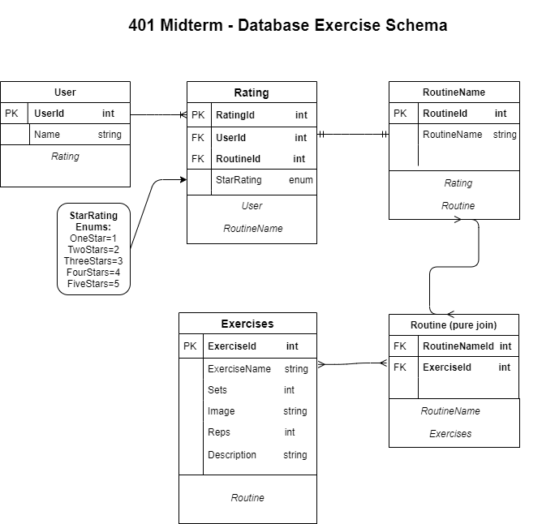
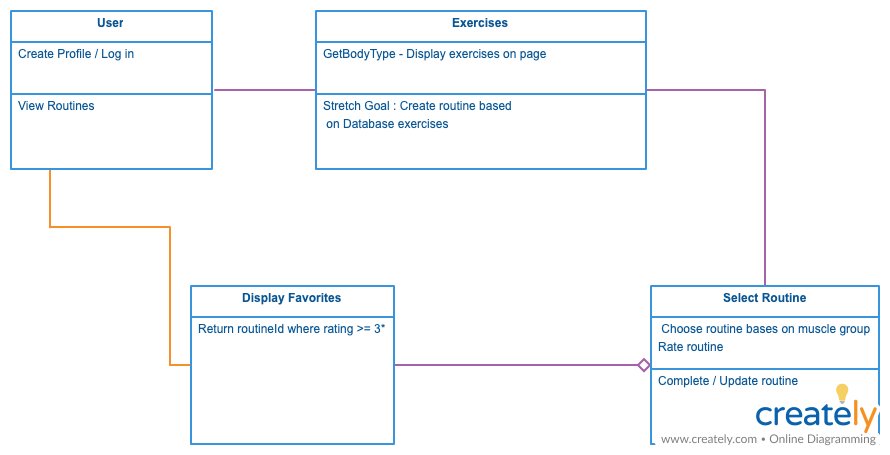

# Requirements

## Vision

- What's the vision of the product?
  - Our vision here at Health At Home is safe and secure home fitness during this COVID-19 outbreak.
- What pain point does this project solve?
  - Users are not able to go to gyms, local fitness areas, and therefore are lacking a viable way to stay fit and healthy while social distancing.
- Why would we care about your product?
  - Because you care about yourself, and want to come out of this terrible time a better you!

## Scope

#### IN - What Our Product Will Do
- Users will be able to create unique "user accounts".
- Users will be able to view a list of predetermined exercise routines.
- Users will be able to give each routine a "star" rating.
- Users will be able to view a list of all "Liked" routines that they've rated at least three stars.

#### OUT - What Our Product WILL NOT Do
- We will never sell our user's data.
- We will ~~probably~~ never fat shame our users.

## MVP (Minimum Viable Product)

The MVP of our application will be to allow users to create a unique "account", and to allow them to browse a selection of workout routines in the database. They can then select a routine, and rate the routine according to their experience. Any routines that have a rating of three stars or higher can be presented in a seperate "Liked Routines" view.

## Stretch Goals

#### Custom Routines

Users will be able to view a list of all available exercises, and create custom routines.

#### "Pretty Stars"

User ratings will be represented in a graphical format (i.e; stars, etc).

#### Motivational Sountracks

Audio clips from the movie **_Major Payne_** will play as you workout, forcing you to push harder than ever before!

## Functional Requirements

- Users can create unique "accounts".
- Users can view a list of all routines in the database.
- Users can view a specific routine from the database.
- Users can rate routines.
- Users can view a list of all rated routines that are at least three stars.
- Users can update their ratings for each routine.

## Data Flow

##### ERD / Database Schema

##### Domain Model

- When the user "logs in" to the app, a request is made to the Users table of the database and determines if that user exists.
  - If the user exists, then the username is returned, and they are "logged in".
  - If the user does not exist, then a user is created and inserted into the DB, and then they are "logged in".
- When the user views the list of routines, a request is made to the Routines table, and returns a list of all routines in the database. The data is then enumerated over and rendered on the routines View.
- When the user decides to view a specific routine, a request is made to the DB for the routine, which then returns the exercies associated with that routine and renders them on the specific routine View.
- When a user clicks to give a routine a rating, a form is submitted to the Ratings table that associates the rating given to the entry matched by the UserID and the RoutineID.
- When a user views the "Liked Routines" View, the DB is queried for all Routines that match the UserID and have a Rating of at least three stars.

## Non-Functional Requirements

#### Usability

The user has a comfortable user experience when navigating through the web app. The web app can functionally perform CRUD operations with the API app / database, allowing the user to perform all functions necessary.

#### Performance

The application will perform at a decent scale in accordance with Time and Space complexity. There will never be a "high stress" workload on the environment because we are simulating "user accounts", therefore there can only every be one set of operations running at a time.

#### Interoperability

The app is deployed to Azure Cloud Services, and accessed via the internet. This enables our app to be cross-platform, and allows users of any device / operating system to make great use of it!